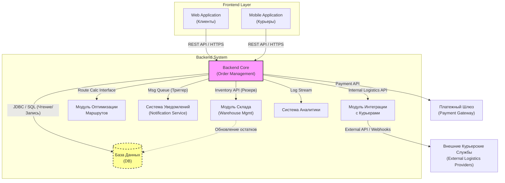

```mermaid 

graph TD
    %% ВНЕШНИЕ СИСТЕМЫ
    ExtCouriers["Внешние Курьерские Службы<br>(External Logistics Providers)"]
    PaymentSys["Платежный Шлюз<br>(Payment Gateway)"]

    %% FRONTEND
    subgraph Frontend_Layer [Frontend Layer]
        WebApp["Web Application<br>(Клиенты)"]
        MobApp["Mobile Application<br>(Курьеры)"]
    end

    %%  BACKEND 
    subgraph Backend_System [Backend System]
        Backend["Backend Core<br>(Order Management)"]
        
        Warehouse["Модуль Склада<br>(Warehouse Mgmt)"]
        RouteOpt["Модуль Оптимизации<br>Маршрутов"]
        Notify["Система Уведомлений<br>(Notification Service)"]
        CourierAdapter["Модуль Интеграции<br>с Курьерами"]
        Analytics["Система Аналитики"]
        
        DB[("База Данных<br>(DB)")]
    end

    %%  СВЯЗИ 

    %% Frontend -> Backend
    WebApp -- "REST API / HTTPS" --> Backend
    MobApp -- "REST API / HTTPS" --> Backend

    %% Backend -> Database
    Backend -- "JDBC / SQL (Чтение/Запись)" --> DB
    Warehouse -. "Обновление остатков" .-> DB

    %% Backend -> Modules
    Backend -- "Inventory API (Резерв)" --> Warehouse
    Backend -- "Route Calc Interface" --> RouteOpt
    Backend -- "Msg Queue (Триггер)" --> Notify
    Backend -- "Log Stream" --> Analytics
    Backend -- "Internal Logistics API" --> CourierAdapter

    %% Внешние связи
    CourierAdapter -- "External API / Webhooks" --> ExtCouriers
    Backend -- "Payment API" --> PaymentSys

    %% Стилизацwd
    style Backend fill:#f9f,stroke:#333,stroke-width:2px
    style DB fill:#ff9,stroke:#333,stroke-width:2px,stroke-dasharray: 5 5

```
