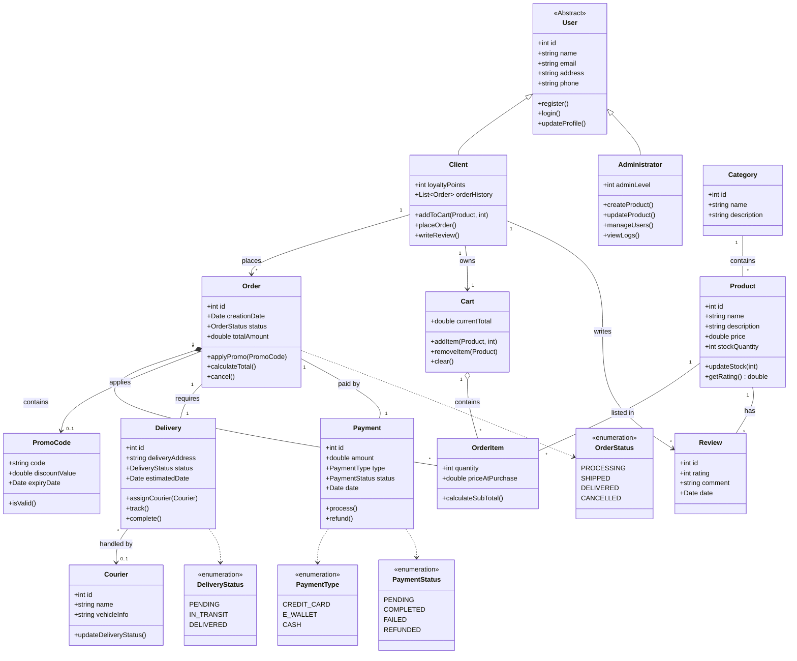

```mermaid              
classDiagram

    %% 1.  пользователь (Абстракция и Наследование)
    class User {
        <<Abstract>>
        +int id
        +string name
        +string email
        +string address
        +string phone
        +register()
        +login()
        +updateProfile()
    }

    class Client {
        +int loyaltyPoints
        +List~Order~ orderHistory
        +addToCart(Product, int)
        +placeOrder()
        +writeReview()
    }

    class Administrator {
        +int adminLevel
        +createProduct()
        +updateProduct()
        +manageUsers()
        +viewLogs()
    }


    %% 2.  товар
    class Product {
        +int id
        +string name
        +string description
        +double price
        +int stockQuantity
        +updateStock(int)
        +getRating() double
    }

    class Category {
        +int id
        +string name
        +string description
    }


    %% 3.  заказ
    class Order {
        +int id
        +Date creationDate
        +OrderStatus status
        +double totalAmount
        +applyPromo(PromoCode)
        +calculateTotal()
        +cancel()
    }

    class OrderItem {
        +int quantity
        +double priceAtPurchase
        +calculateSubTotal()
    }

    class Cart {
        +double currentTotal
        +addItem(Product, int)
        +removeItem(Product)
        +clear()
    }

    class PromoCode {
        +string code
        +double discountValue
        +Date expiryDate
        +isValid()
    }


    %% 4.  логистиккаа
    class Delivery {
        +int id
        +string deliveryAddress
        +DeliveryStatus status
        +Date estimatedDate
        +assignCourier(Courier)
        +track()
        +complete()
    }

    class Courier {
        +int id
        +string name
        +string vehicleInfo
        +updateDeliveryStatus()
    }

    %% 5.  финансыы
    class Payment {
        +int id
        +double amount
        +PaymentType type
        +PaymentStatus status
        +Date date
        +process()
        +refund()
    }

    %% 6.  отзыв
    class Review {
        +int id
        +int rating
        +string comment
        +Date date
    }

    %%  ENUMS (Перечисления) 
    class OrderStatus {
        <<enumeration>>
        PROCESSING
        SHIPPED
        DELIVERED
        CANCELLED
    }

    class DeliveryStatus {
        <<enumeration>>
        PENDING
        IN_TRANSIT
        DELIVERED
    }

    class PaymentType {
        <<enumeration>>
        CREDIT_CARD
        E_WALLET
        CASH
    }

    class PaymentStatus {
        <<enumeration>>
        PENDING
        COMPLETED
        FAILED
        REFUNDED
    }


    %%  ОТНОШЕНИЯ 

    %% Наследование
    User <|-- Client
    User <|-- Administrator

    %% Пользователи и Заказы
    Client "1" --> "*" Order : places
    Client "1" --> "1" Cart : owns
    Cart "1" o-- "*" OrderItem : contains

    %% Заказы и Товары
    Order "1" *-- "*" OrderItem : contains
    Product "1" -- "*" OrderItem : listed in
    
    %% Товары и Категории
    Category "1" -- "*" Product : contains

    %% Заказы и Промокоды
    Order "*" --> "0..1" PromoCode : applies

    %% Логистика
    Order "1" -- "1" Delivery : requires
    Delivery "*" --> "0..1" Courier : handled by

    %% Финансы
    Order "1" -- "1" Payment : paid by

    %% Отзывы (Связь с клиентом и товаром)
    Client "1" --> "*" Review : writes
    Product "1" -- "*" Review : has
    
    %% Зависимости от Enum
    Order ..> OrderStatus
    Delivery ..> DeliveryStatus
    Payment ..> PaymentType
    Payment ..> PaymentStatus


```
