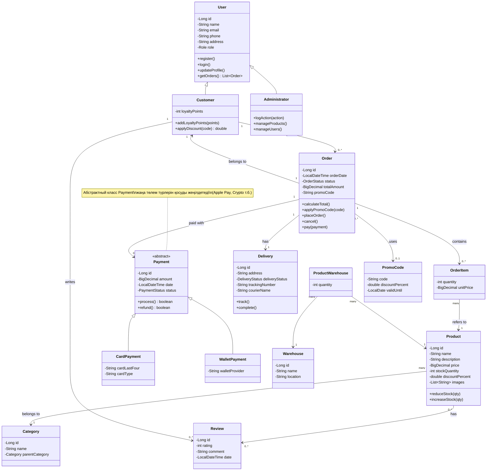

```mermaid

classDiagram
    direction TB

    class User {
        -Long id
        -String name
        -String email
        -String phone
        -String address
        -Role role
        +register()
        +login()
        +updateProfile()
        +getOrders() List~Order~
    }

    class Customer {
        -int loyaltyPoints
        +addLoyaltyPoints(points)
        +applyDiscount(code) double
    }

    class Administrator {
        +logAction(action)
        +manageProducts()
        +manageUsers()
    }

    class Category {
        -Long id
        -String name
        -Category parentCategory
    }

    class Product {
        -Long id
        -String name
        -String description
        -BigDecimal price
        -int stockQuantity
        -double discountPercent
        -List~String~ images
        +reduceStock(qty)
        +increaseStock(qty)
    }

    class Payment {
        <<abstract>>
        -Long id
        -BigDecimal amount
        -LocalDateTime date
        -PaymentStatus status
        +process() boolean
        +refund() boolean
    }

    class CardPayment {
        -String cardLastFour
        -String cardType
    }

    class WalletPayment {
        -String walletProvider
    }

    class Order {
        -Long id
        -LocalDateTime orderDate
        -OrderStatus status
        -BigDecimal totalAmount
        -String promoCode
        +calculateTotal()
        +applyPromoCode(code)
        +placeOrder()
        +cancel()
        +pay(payment)
    }

    class OrderItem {
        -int quantity
        -BigDecimal unitPrice
    }

    class Delivery {
        -Long id
        -String address
        -DeliveryStatus deliveryStatus
        -String trackingNumber
        -String courierName
        +track()
        +complete()
    }

    class Review {
        -Long id
        -int rating
        -String comment
        -LocalDateTime date
    }

    class Warehouse {
        -Long id
        -String name
        -String location
    }

    class ProductWarehouse {
        -int quantity
    }

    class PromoCode {
        -String code
        -double discountPercent
        -LocalDate validUntil
    }

    %% Наследование
    User <|-- Customer
    User <|-- Administrator
    Payment <|-- CardPayment
    Payment <|-- WalletPayment

    %% Связи
    Customer "1" --> "0..*" Order : places
    Order "1" --> "1" Customer : belongs to
    Order "1" --> "1" Delivery : has
    Order "1" --> "0..*" OrderItem : contains
    OrderItem "many" --> "1" Product : refers to
    Product "many" --> "1" Category : belongs to
    Product "0..*" --> "0..*" Review : has
    Customer "1" --> "0..*" Review : writes
    ProductWarehouse "many" --> "1" Product
    ProductWarehouse "many" --> "1" Warehouse
    Order "1" --> "0..1" Payment : paid with
    Order "0..*" --> "0..1" PromoCode : uses

    %% Ескертпе
    note for Payment "Абстрактный класс Payment\nжаңа төлем түрлерін қосуды жеңілдетеді\n(Apple Pay, Crypto т.б.)"

```
