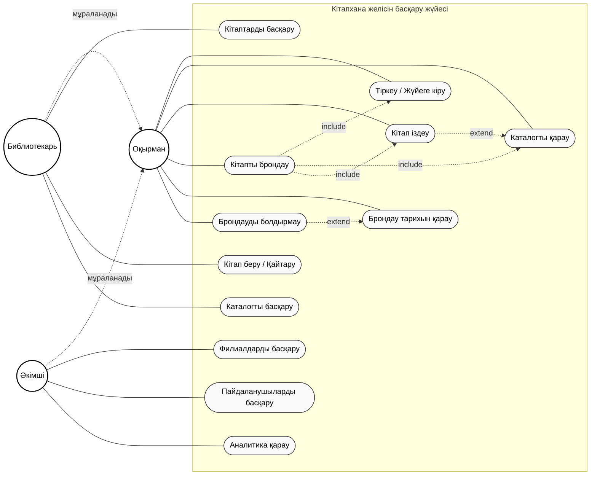

```mermaid
graph LR            
    %% СТИЛИ
    classDef actorStyle fill:#fff,stroke:#000,stroke-width:2px,color:#000;
    classDef usecaseStyle fill:#f9f9f9,stroke:#333,stroke-width:1px,rx:10,ry:10,color:#000;

    User_Reader((Оқырман)):::actorStyle
    User_Librarian((Библиотекарь)):::actorStyle
    User_Admin((Әкімші)):::actorStyle

    %% МҰРАГЕРЛІК (Наследование)
    User_Librarian -.->|мұраланады| User_Reader
    User_Admin -.->|мұраланады| User_Reader

    subgraph System [Кітапхана желісін басқару жүйесі]
        direction TB
        
        %% Негізгі функциялар
        UC_Login([Тіркеу / Жүйеге кіру]):::usecaseStyle
        UC_View([Каталогты қарау]):::usecaseStyle
        UC_Search([Кітап іздеу]):::usecaseStyle
        UC_Reserve([Кітапты брондау]):::usecaseStyle
        UC_History([Брондау тарихын қарау]):::usecaseStyle
        UC_Cancel([Брондауды болдырмау]):::usecaseStyle
        
        %% Персонал функциялары
        UC_ManageBooks([Кітаптарды басқару]):::usecaseStyle
        UC_IssueReturn([Кітап беру / Қайтару]):::usecaseStyle
        UC_ManageCatalog([Каталогты басқару]):::usecaseStyle
        
        %% Әкімші функциялары
        UC_Branches([Филиалдарды басқару]):::usecaseStyle
        UC_ManageUsers([Пайдаланушыларды басқару]):::usecaseStyle
        UC_Analytics([Аналитика қарау]):::usecaseStyle
    end

    %% Оқырман
    User_Reader --- UC_Login
    User_Reader --- UC_View
    User_Reader --- UC_Search
    User_Reader --- UC_Reserve
    User_Reader --- UC_History
    User_Reader --- UC_Cancel

    %% Библиотекарь (Оқырманның барлық функцияларын + өзінікін пайдаланады)
    User_Librarian --- UC_ManageBooks
    User_Librarian --- UC_IssueReturn
    User_Librarian --- UC_ManageCatalog

    %% Әкімші
    User_Admin --- UC_Branches
    User_Admin --- UC_ManageUsers
    User_Admin --- UC_Analytics

    %% <<include>> және <<extend>> байланыстары
    UC_Reserve -.->|include| UC_Login
    UC_Reserve -.->|include| UC_View
    UC_Search -.->|extend| UC_View
    
    UC_Cancel -.->|extend| UC_History
    UC_Reserve -.->|include| UC_Search
```
