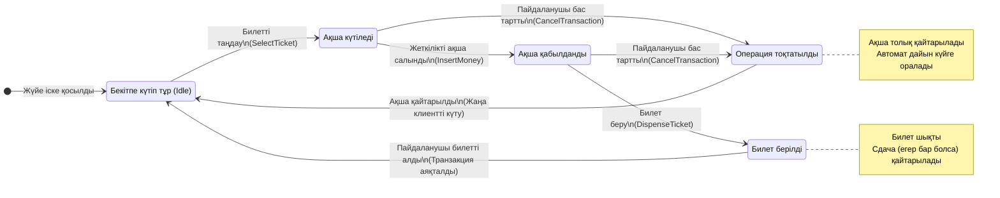

```mermaid   
stateDiagram-v2
    direction LR

    %% Басты нүкте
    [*] --> BekitpeKutu: Жүйе іске қосылды

    %% Состояния (аты : қазақша сипаттамасы)
    state "Бекітпе күтіп тұр (Idle)" as BekitpeKutu
    state "Ақша күтіледі" as AqshaKutude
    state "Ақша қабылданды" as AqshaQabyldandy
    state "Билет берілді" as BiletBerildi
    state "Операция тоқтатылды" as OperatsiyaToqtatyldy

    %% ПЕРЕХОДТАР ЖӘНЕ ТРИГГЕРЛЕР (оқиғалар)

    %% 1. Пайдаланушы билет таңдайды
    BekitpeKutu --> AqshaKutude : Билетті таңдау\n(SelectTicket)

    %% 2. Ақша салады (жеткілікті сумма)
    AqshaKutude --> AqshaQabyldandy : Жеткілікті ақша салынды\n(InsertMoney)

    %% 3. Билет беріледі
    AqshaQabyldandy --> BiletBerildi : Билет беру\n(DispenseTicket)

    %% 4. Билет алынған соң автомат босайды
    BiletBerildi --> BekitpeKutu : Пайдаланушы билетті алды\n(Транзакция аяқталды)

    %% 5. Кез келген сәтте бас тарту
    AqshaKutude --> OperatsiyaToqtatyldy : Пайдаланушы бас тартты\n(CancelTransaction)
    AqshaQabyldandy --> OperatsiyaToqtatyldy : Пайдаланушы бас тартты\n(CancelTransaction)

    %% 6. Бас тартудан кейін қайта бастапқы күйге
    OperatsiyaToqtatyldy --> BekitpeKutu : Ақша қайтарылды\n(Жаңа клиентті күту)

    %% Қосымша ескертпелер (note)
    note right of OperatsiyaToqtatyldy
        Ақша толық қайтарылады
        Автомат дайын күйге оралады
    end note

    note right of BiletBerildi
        Билет шықты
        Сдача (егер бар болса) қайтарылады
    end note
```
