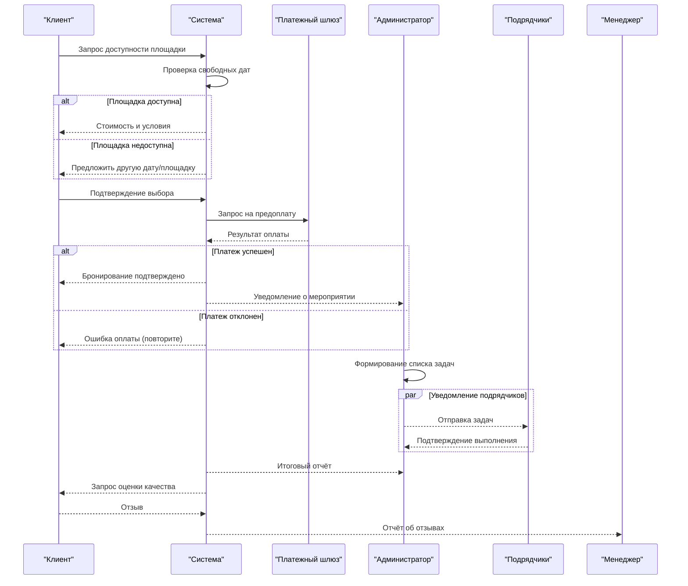

```mermaid
sequenceDiagram
    participant Client as "Клиент"
    participant System as "Система"
    participant Pay as "Платежный шлюз"
    participant Admin as "Администратор"
    participant Contractors as "Подрядчики"
    participant Manager as "Менеджер"

    %% === Этап 1: Запрос доступности ===
    Client->>System: Запрос доступности площадки
    System->>System: Проверка свободных дат

    alt Площадка доступна
        System-->>Client: Стоимость и условия
    else Площадка недоступна
        System-->>Client: Предложить другую дату/площадку
    end

    %% === Этап 2: Подтверждение бронирования ===
    Client->>System: Подтверждение выбора
    System->>Pay: Запрос на предоплату
    Pay-->>System: Результат оплаты

    alt Платеж успешен
        System-->>Client: Бронирование подтверждено
        System-->>Admin: Уведомление о мероприятии
    else Платеж отклонен
        System-->>Client: Ошибка оплаты (повторите)
    end

    %% === Этап 3: Организация мероприятия ===
    Admin->>Admin: Формирование списка задач

    par Уведомление подрядчиков
        Admin-->>Contractors: Отправка задач
        Contractors-->>Admin: Подтверждение выполнения
    end

    System-->>Admin: Итоговый отчёт

    %% === Этап 4: Завершение мероприятия ===
    System-->>Client: Запрос оценки качества
    Client-->>System: Отзыв
    System-->>Manager: Отчёт об отзывах
```
