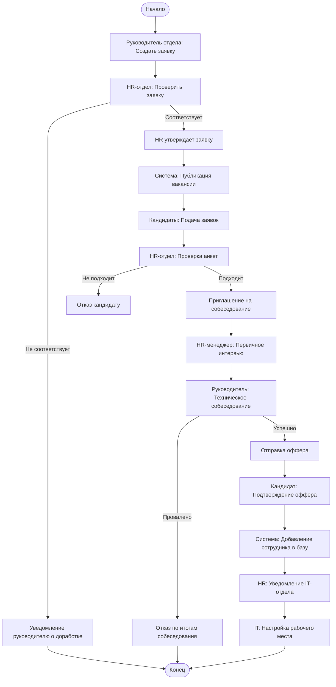

Основные элементы: Участники (Swimlanes): Диаграмма разделена на 5 зон ответственности: Руководитель, HR, Система, Кандидат и IT. Это позволяет четко видеть, кто за что отвечает. Начало и конец: Обозначены оранжевыми кругами (Начало, Конец).

Логика ветвлений (Decisions): На диаграмме представлены ключевые точки принятия решений (ромбы):

Валидация заявки: Циклическая проверка. Если HR отклоняет заявку, процесс возвращается к Руководителю через уведомление Системы. Скрининг резюме: Если кандидат не подходит на этапе анкеты, Система отправляет автоматический отказ. Результат собеседований: Проверка происходит после этапов HR и Технического интервью. Если любой из них провален, процесс идет к отказу. Решение кандидата: Кандидат может отказаться от оффера даже после успешного прохождения всех этапов.

Параллельные действия (Fork/Join): В финальной части использован паттерн Fork (черный круг разветвления), когда кандидат принимает оффер. Запускаются два параллельных процесса: Система: Добавляет сотрудника в базу данных. HR и IT: HR уведомляет IT, и IT начинает настройку рабочего места. Эти действия происходят одновременно и сходятся в точке Join перед завершением процесса

